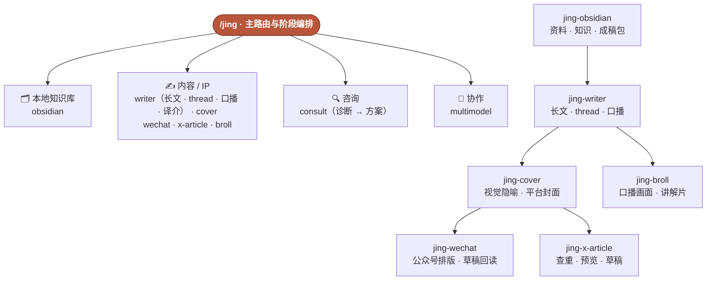

<div align="center">

# jingskills · builder 实战工具箱

**9 个从真实业务中沉淀的 AI Skill：默认替你判断下一步，也能把稳定流程连续跑完。**

本地知识库 · 内容生产 · X 创作 · 企业咨询 · 多模型协作


[](#-skill-全目录9)
[](#-实测与验证)
[](#-实测与验证)
[](#-安装)

</div>

---

jingskills 是一套给 Claude Code、Codex 等 AI Agent 使用的 builder 工具箱。它不是一堆“应该怎么想”的提示词，而是把真实工作中反复出现、容易犯错的流程，收敛成可以直接执行、可以验证、可以恢复的 Skill。

不用先记住 9 个名字。把处境交给 `/jing`：

- 下一步还不稳定时，它只选择此刻最该做的一步。
- 终点已经明确、阶段之间有正式交接时，它连续执行整条管线。
- 涉及删除、发布、生产修改等高影响动作时，仍然守住确认边界。

```text
你：这篇英文文章写得很好，想翻译过来发公众号
  → /jing-writer 译介模式先过授权与署名两道门
  → source_permission 没放行就停在本地译文
  → 拿到许可后再进平台草稿

你：把这个 idea 写成文章，做公众号和 X 封面，再放进两个平台的草稿箱
  → /jing-writer 完成长文与质量检查
  → /jing-cover 生成各平台封面
  → /jing-wechat 确认排版并更新公众号原草稿
  → /jing-x-article 保存并验证草稿
  → 停在草稿，不自动发布

你：把这篇定稿继续做成一条口播视频
  → /jing-writer 重新选择一个视频判断
  → 生成逐字稿、拍摄节奏、素材清单和录前核对
  → 需要拼贴画面时再交给 /jing-broll
```

## 🎯 你交给它什么，它替你完成什么

| 你手上的 | jingskills 完成的 | 入口 |
|---|---|---|
| 一个空目录或已有 Obsidian 库 | 安全建立资料、知识、成稿包、草稿、发布与回流骨架 | `/jing-obsidian` |
| 一个 idea、剪藏或旧草稿 | 事实清单、情绪结构、Jing 语气、可浏览中文长文 | `/jing-writer` |
| 一段真实实践 | 装配成 build-in-public thread 骨架，不虚构第一人称 | `/jing-writer`（thread 模式） |
| 一篇已经核验的长文 | 重新选角度，生成可直接录制的口播稿、拍摄节奏和素材清单 | `/jing-writer`（口播再分发模式） |
| 一篇已经定稿的文章 | 一个编辑隐喻，分别输出公众号、普通 X、X Article 封面 | `/jing-cover` |
| 定稿文章、公众号封面与排版偏好 | 手机端富文本预览、原草稿更新、UTF-8 回读验收 | `/jing-wechat` |
| 几句口播文稿或一个完整选题 | 拼贴 B-roll，或 beat map 驱动的 45–60 秒带旁白字幕讲解片 | `/jing-broll` |
| 长文与 5:2 封面 | 查重或恢复原草稿，写入 X Articles，检查预览与保存 | `/jing-x-article` |
| 别人写的好文章 | 译介模式：授权与署名两道门，全文翻译或编译，不洗稿 | `/jing-writer`（译介模式） |
| 一个“能不能上 AI”的客户 | 诊断段：六维就绪度、病灶、风险等级与变绿条件 | `/jing-consult` |
| 一份诊断结论 | 方案段：架构、选型、Phase 0–3、预算和运营责任 | `/jing-consult` |
| 一个适合并行、复核或实时调研的大任务 | Grok、Claude、Codex 的最小充分分工；隔离检索 X、Reddit、网页并由主控验收 | `/jing-multimodel` |
| **不知道从哪里开始** | 读取当前处境，替你选下一步或正式管线 | **`/jing`** |

## 🧭 一张图看懂



更细的交接关系见 [skill 关系图](docs/skill-link-map.md)。

## 🏭 长文生产管线

管线的每一阶段都有必须通过的门控，不是把几个 Skill 用箭头连起来就算完成。

| 阶段 | 负责什么 | 必须通过的门控 |
|---|---|---|
| `jing-obsidian`（按需） | 新建或适配用户自己的本地知识库 | 先预演；已有文件零覆盖、零移动；结构检查为 ready |
| `jing-writer` | 从 idea、资料或草稿生成中文长文，也把定稿改编为 thread 骨架或口播内容包 | 事实可追溯；不虚构经历；母稿是唯一真源；长文和口播分别通过对应检查 |
| `jing-cover` | 把文章判断压缩成一个视觉隐喻 | 公众号、普通 X、5:2 Article 按各自尺寸分别用 Image 2 直出；验收构图、安全区与缩略图可读性，不跨平台裁切复用 |
| `jing-wechat` | 把定稿与公众号封面送进微信草稿箱 | 先确认手机预览；优先更新原草稿；标题、摘要、封面、全文、署名和 UTF-8 回读通过 |
| `jing-x-article` | 把本地成稿送进登录中的 X Articles | 优先恢复原草稿；富文本保留标题与加粗；空白段落为零；封面、首尾、预览和保存状态全部核对 |

管线支持中断恢复。例如浏览器暂时不能读取本地封面时，会保留同一草稿并记录 `draft-needs-cover`；权限恢复后只补封面，不重新建稿，也不重复写正文。

完整门控与恢复规则见 [Jing 长文生产管线](skills/jing/references/content-pipeline.md)。

## 🗂 Skill 全目录（9）

| 线 | Skill | 干什么 |
|---|---|---|
| 🧭 路由 | **`/jing`** | 读取处境，选择下一步；终点明确时编排正式管线 |
| 🗂 知识库 | `/jing-obsidian` | 新建、检查或增量适配本地 Obsidian 内容知识库 |
| ✍️ 内容 | `/jing-writer` | idea / 资料 / 草稿 → 中文长文；实战 → thread 骨架；定稿 → 口播内容包；他人文章 → 译介稿 |
| | `/jing-cover` | 定稿文章 → 公众号、普通 X、X Article 封面 |
| | `/jing-broll` | 口播文稿 / 选题 → 拼贴 B-roll 或完整拼贴讲解片 |
| | `/jing-wechat` | 定稿文章与公众号封面 → 已验证的微信公众号草稿 |
| | `/jing-x-article` | 长文与 5:2 封面 → 已验证的 X Articles 草稿 |
| 🔍 咨询 | `/jing-consult` | 诊断段：就绪度评估与红黄绿评级；方案段：蓝图、分期与预算 |
| 🤝 协作 | `/jing-multimodel` | Grok / Claude / Codex 分工、复核、竞赛；Grok 隔离检索 X、Reddit 与网页 |

`jing-writer` 处理证据型长文，`jing-wechat` 只接收定稿并负责排版与草稿验收；两者不混用。

## 📊 实测与验证

jingskills 把“文档写完”与“Skill 真能防错”分开检查。

| 检查 | 当前结果 | 含义 |
|---|---:|---|
| Skill 数量 | **9** | 包含 `/jing` 主路由与 8 个成员 |
| 场景测试 | **77** | 正常、边界与失败场景均记录在各 Skill 的 `evals/evals.json`，部分 Skill 使用更细分类 |
| 结构校验 | **9 / 9 通过** | 名称、目录、frontmatter 与资源结构有效 |

场景测试是断言集，记录每个 Skill 该防住什么；`tools/build.sh` 负责结构校验。带 / 不带 Skill 的对照实测尚未在本仓库跑过，所以这里不给对照分数。

最能体现 Skill 价值的不是文风，而是防住真实损害：

| Skill | 防住的问题 |
|---|---|
| `/jing-consult` | 不因老板想“一期全上”而抹掉红灯前提 |
| `/jing-obsidian` | 不覆盖、移动或批量改写用户已有笔记 |
| `/jing-writer` | 不虚构作者经历，也不交付没有阅读锚点的长文 |
| `/jing-writer` 译介模式 | 不把别人的文章洗成自己的原创，授权没落地不进平台草稿 |
| `/jing-writer` 口播模式 | 不把长文机械缩写，不让衍生稿脱离母稿自行增加事实 |
| `/jing-wechat` | 不重复建微信草稿、不把中文乱码或接口成功码误判成完成 |
| `/jing-x-article` | 不重复建稿、不丢富文本格式、不把输入完成当成保存完成 |

## ✅ 适合 / ❌ 不适合

**适合：**

- 一个人或小团队同时处理基建、内容、咨询、产品和运营。
- 想把真实实践沉淀成可复用、可验证流程的 builder。
- 使用 Claude Code、Codex 等 Agent 完成真实业务，而不只是问答。
- 需要 Agent 既能主动做完，又能在发布、删除和生产修改前守住边界。

**不适合：**

- 只需要一个领域的超深度专用工具。
- 纯陪聊、纯灵感或无需验证的一次性问答。
- 希望 Agent 无条件自动发布、自动删除或绕过确认。
- 不在这些真实工作流中的通用任务。

## 🚀 安装

**Claude Code 插件（推荐）** — 本仓库自带 marketplace，`git pull` 即可更新：

```text
/plugin marketplace add bitcoinjohnny/jingskills
/plugin install jingskills@bitcoinjohnny
```

**任意 Agent Skills 兼容宿主** — Codex 等按标准 skill 包安装：

```bash
npx -y skills add bitcoinjohnny/jingskills -g --all
```

两条路径装的是同一套 `skills/` 目录，不会互相冲突。安装后可以从 `/jing` 开始，也可以直接调用具体 Skill：

```text
/jing 我有个客户想上 AI 客服，不知道该先做什么
/jing 把这个 idea 走完整条内容管线，做到 X Articles 草稿，不要发布
/jing-obsidian 在这个本地目录搭一套可以接写作管线的知识库
/jing-writer 把这条剪藏发展成一篇公众号长文
/jing-writer 把这篇定稿改成一条 2 到 3 分钟的口播视频稿
/jing-cover 给这篇定稿文章做公众号和 X Article 封面
/jing-wechat 把定稿排版并更新到已有公众号草稿，先预览再写入
/jing-x-article 把文章和 5:2 封面保存到 X 后台，不要发布
/jing-multimodel 让 Grok 和 Claude 独立给方案，由你验收
```

第一次使用建议先看 [新手入门](docs/新手入门.md)。

### WorkBuddy

运行 `bash tools/build.sh` 后，`dist/workbuddy/` 会生成每个 Skill 的独立 ZIP。进入 WorkBuddy 的技能页，选择“添加技能 → 上传技能”，直接导入所需 ZIP；包内的 `SKILL.md`、参考资料、脚本和模板会一起保留。

`jing-wechat` 的本地检查和草稿脚本只依赖 Python 标准库，外部排版器按宿主实际安装状态调用；没有公众号凭证或网络权限时停在本地预览，不冒充已经写入草稿。`jing-x-article` 会选择当前宿主可用的浏览器或电脑控制能力，没有这类能力时会停在本地交付包。

### 豆包

豆包当前没有本地 `SKILL.md` 技能包导入入口，因此不能直接安装 jingskills。纯文字型成员可以人工转成智能体提示词，但脚本、浏览器操作、数据连接和多模型调度不会随提示词迁移；仓库仍以标准 Skill 包为唯一真源，不维护一套容易漂移的豆包副本。

## 🏛 架构与纪律

| 原则 | 做法 |
|---|---|
| 单一真源 | monorepo 是 Skill 唯一真源，不维护分叉副本 |
| 渐进披露 | `SKILL.md` 只保留工作流骨架，详细规则进入 `references/`，重复操作进入 `scripts/` |
| 明确自由度 | 判断型任务保留空间；上传、清理、部署等脆弱流程使用严格顺序和验收门控 |
| 可恢复 | 中断后优先读取本地状态和已有 URL，续写原任务，不制造重复项 |
| 可验证 | 每个 Skill 都有场景测试；脚本必须实际运行；高风险结果必须保留可核对证据 |
| 不越权 | 不自动发布、不编造数据、不虚构经历；删除与生产改动遵守确认边界 |
| 构建门控 | `tools/build.sh` 校验目录名与 Skill 名称，beta Skill 不进入产物 |

`jing-multimodel` 内置的 Grok 隔离搜索组件来自 [sudoHG/codex-grok-search](https://github.com/sudoHG/codex-grok-search)，按 MIT 协议保留原版权与许可；其余 jingskills 内容仍遵循仓库根目录的 CC BY-NC 4.0。

## 📚 文档

- [新手入门](docs/新手入门.md) — 第一次怎么用与完整目录
- [Skill 关系图](docs/skill-link-map.md) — 成员之间的常见衔接
- [长文生产管线](skills/jing/references/content-pipeline.md) — Writer → Cover → WeChat / X Article 的交接与恢复
- [公众号排版契约](skills/jing-wechat/references/layout-contract.md) — 移动端层级、署名策略与外部排版器边界
- [环境与能力](docs/环境与能力.md) — 各 Skill 实际能跑到哪一步、凭据放哪、Gemini 免费层限制
- [本地知识库结构](skills/jing-obsidian/references/vault-schema.md) — 资料、知识、创作、发布与回流的目录职责

---

<div align="center">
<sub>jingskills · AI Builder 实战工具箱</sub>

<sub>基于 <a href="https://github.com/imraywang/rayskills">imraywang/rayskills</a>（作者 <a href="https://x.com/wangray">@wangray</a>）改造，CC BY-NC 4.0，改动见 <a href="LICENSE">LICENSE</a>。</sub>
</div>
