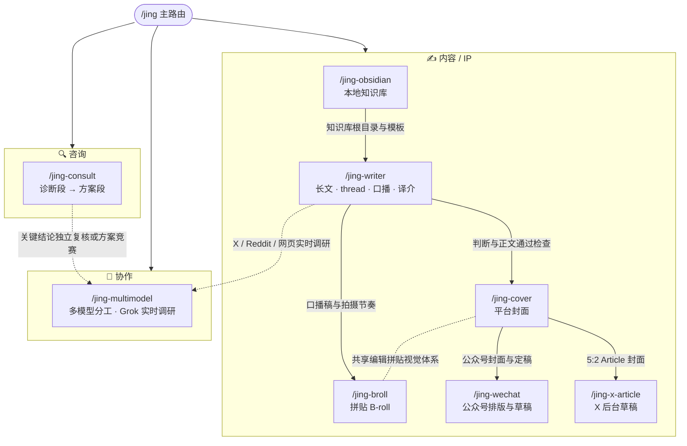

# jingskills 关系图

`/jing` 是主入口，默认读上下文分发到一个成员 skill。用户明确要求从 idea 一路做到公众号或 X 草稿时，使用已经验证的内容生产管线连续执行；线上写入和发布仍分别守住确认边界。

## 衔接逻辑

- **咨询漏斗**:`jing-consult` 内部完成诊断段(免费诊断,漏斗入口)→ 方案段(付费方案)的正式交接。红灯诊断时,方案 Phase 0 = 补齐前提。
- **实战 → 内容飞轮**:任何一段实战(上线/排障/事故处置)完成后,`jing-writer` 的 thread 骨架模式把它变成 IP 素材(守不代笔)。
- **知识库 → 长文 → 封面 → 平台草稿**：没有兼容知识库时，`jing-obsidian` 先安全建立资料、知识、成稿包、草稿和发布结构；`jing-writer` 完成事实、情绪、二级标题、重点加粗和段落检查；`jing-cover` 从核心判断出发，按公众号、普通 X、5:2 Article 各自尺寸分别用 Image 2 直出，验收构图与安全区；`jing-wechat` 负责公众号排版、预览确认、原草稿更新和 UTF-8 回读；`jing-x-article` 负责 X 草稿续写或查重、富文本写入、封面裁切、预览和保存。用户明确要求完整管线时连续执行，线上写入与发布仍由用户确认。
- **译介支线**：内容主体属于别人的文章，`jing-writer` 译介模式先过授权与署名两道门；`source_permission` 没放行时 `jing-wechat` 与 `jing-x-article` 都只做本地产物。
- **母稿 → 多次分发**：`jing-writer` 把通过检查的长文作为唯一真源，重新选一个适合视频的判断，生成带母稿指纹的口播稿、拍摄节奏和素材清单；需要拼贴画面时再交给 `jing-broll`。公众号和 X 继续各自做格式转换，图片长文先保留视觉接口，后续再接独立样式系统。
- **主控 → 外部通道**:`jing-multimodel` 只在大体量执行、独立复核、方案竞赛，或 X / Reddit / 网页实时调研有明确收益时启用。`scout` 使用隔离的 Grok 搜索流程，默认 quick，明确要求深度核实时使用 deep；当前会话始终负责最终验收。
